# View-to-DB Flow

Full dependency flow from `MainWindow.axaml` through ViewModels, services, and repositories to `AppDbContext`.

```mermaid
flowchart TD
    classDef view fill:#1a3a5c,stroke:#4a9eff,color:#fff
    classDef vm   fill:#1a4a2a,stroke:#4aff7a,color:#fff
    classDef svc  fill:#4a3a10,stroke:#ffcc44,color:#fff
    classDef repo fill:#3a1a4a,stroke:#cc66ff,color:#fff
    classDef db   fill:#4a1a1a,stroke:#ff6666,color:#fff
    classDef table fill:#2a1a1a,stroke:#ff9999,color:#fff

    MW["MainWindow (AXAML)"]
    MWV["MainWindowViewModel"]
    DV["DashboardView"]
    FV["FilesView"]
    AV["ActivityView"]
    AccV["AccountsView"]
    CLV["FileClassificationsView"]
    SV["SettingsView"]
    SRV["SyncedFileSearchView"]
    DVM["DashboardViewModel"]
    FVM["FilesViewModel"]
    ACVM["ActivityViewModel"]
    ACSVM["AccountsViewModel"]
    CLVM["FileClassificationRulesViewModel"]
    STVM["SettingsViewModel"]
    SRVM["SyncedFileSearchViewModel"]
    AFVM["AccountFilesViewModel"]
    SEA["ISyncEventAggregator"]
    ISR["ISyncRepository"]
    IAUTH["IAuthService"]
    IGRAPH["IGraphService"]
    ISRS["ISyncRuleService"]
    IAR["IAccountRepository"]
    IONS["IAccountOnboardingService"]
    IQR["IQuotaRefreshService"]
    IFCR["IFileClassificationRepository"]
    IACR["IAccountRepository"]
    ISS["ISettingsService"]
    ISCH["ISyncScheduler"]
    ISIR["ISyncedItemRepository"]
    ARep["AccountRepository"]
    SRep["SyncRepository"]
    FCRep["FileClassificationRepository"]
    SIRep["SyncedItemRepository"]
    DBC["AppDbContext"]
    T1[("Accounts")]
    T2[("SyncConflicts")]
    T3[("SyncJobs")]
    T4[("DriveStates")]
    T5[("SyncRules")]
    T6[("SyncedItems")]
    T7[("SyncedItemFileClassifications")]
    T8[("FileClassificationCategories")]
    T9[("FileClassificationKeywords")]

    class MW view
    class DV,FV,AV,AccV,CLV,SV,SRV view
    class MWV,DVM,FVM,ACVM,ACSVM,CLVM,STVM,SRVM,AFVM vm
    class SEA,ISR,IAUTH,IGRAPH,ISRS,IAR,IONS,IQR,IFCR,IACR,ISS,ISCH,ISIR svc
    class ARep,SRep,FCRep,SIRep repo
    class DBC db
    class T1,T2,T3,T4,T5,T6,T7,T8,T9 table

    MW -->|"DataContext"| MWV

    MWV -->|"Dashboard"| DV
    MWV -->|"Files"| FV
    MWV -->|"Activity"| AV
    MWV -->|"Accounts"| AccV
    MWV -->|"Classifications"| CLV
    MWV -->|"Settings"| SV
    MWV -->|"Search"| SRV
    MWV --- ACSVM

    DV -->|"DataContext"| DVM
    FV -->|"DataContext"| FVM
    AV -->|"DataContext"| ACVM
    AccV -->|"DataContext = MainWindowViewModel"| MWV
    CLV -->|"DataContext"| CLVM
    SV -->|"DataContext"| STVM
    SRV -->|"DataContext"| SRVM

    FVM -->|"Factory"| AFVM

    DVM --> SEA
    ACVM --> ISR
    ACVM --> SEA
    AFVM --> IAUTH
    AFVM --> IGRAPH
    AFVM --> ISRS
    ACSVM --> IAUTH
    ACSVM --> IGRAPH
    ACSVM --> IAR
    ACSVM --> IONS
    ACSVM --> IQR
    CLVM --> IFCR
    STVM --> IACR
    STVM --> ISS
    STVM --> ISCH
    SRVM --> ISIR
    SRVM --> IACR

    IAR -->|"impl"| ARep
    IACR -->|"impl"| ARep
    ISR -->|"impl"| SRep
    IFCR -->|"impl"| FCRep
    ISIR -->|"impl"| SIRep

    ARep -->|"IDbContextFactory"| DBC
    SRep -->|"IDbContextFactory"| DBC
    FCRep -->|"IDbContextFactory"| DBC
    SIRep -->|"IDbContextFactory"| DBC

    DBC --> T1
    DBC --> T2
    DBC --> T3
    DBC --> T4
    DBC --> T5
    DBC --> T6
    DBC --> T7
    DBC --> T8
    DBC --> T9
```

## Notes

- `AccountsView` DataContext is `MainWindowViewModel` directly — no separate AccountsViewModel DataContext.
- `ActivityViewModel` queries `ISyncRepository` for persisted conflicts on account switch; live events arrive via `ISyncEventAggregator`.
- `FilesViewModel` is a thin tab shell — Graph API calls and auth happen inside `AccountFilesViewModel` (one per account).
- All repositories use `IDbContextFactory<AppDbContext>` — no shared `DbContext` instance.
- `ISyncRuleService` is a domain service wrapping `ISyncRuleRepository`; the VM layer never touches the rule repository directly.
