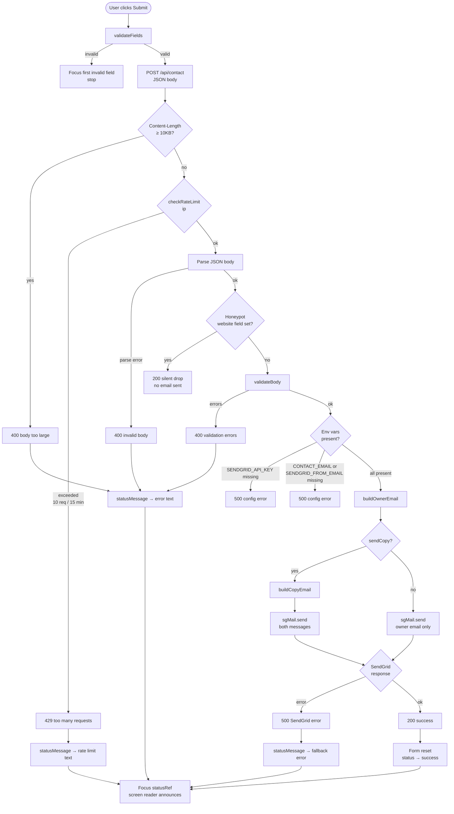

# Contact Form Flow

## Azure Settings (App Settings / Env variables)

| Setting             | Purpose                                       |
| ------------------- | --------------------------------------------- |
| SENDGRID_API_KEY    | Authenticates to SendGrid API                 |
| CONTACT_EMAIL       | Recipient of inbound contact messages (owner) |
| SENDGRID_FROM_EMAIL | Verified sender address in SendGrid           |
